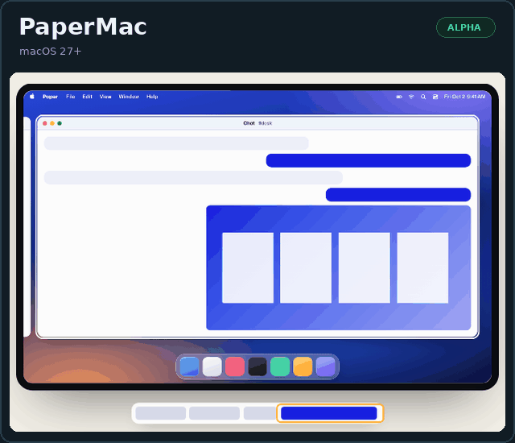
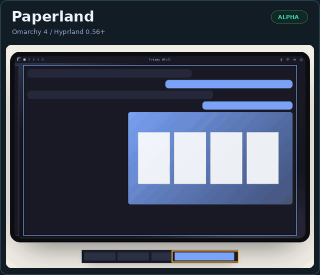
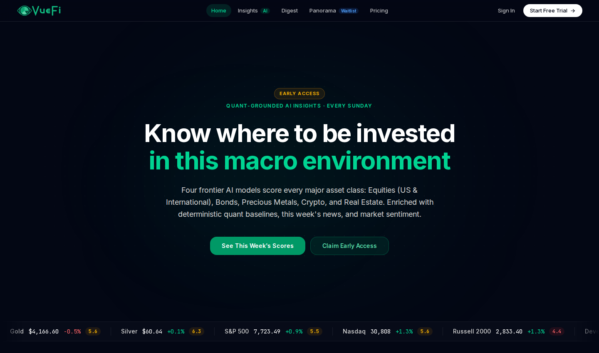

<p>
<picture>
  <source media="(max-width: 520px)" srcset="./profile/visual/portfolio/hero-mobile.svg">
  
</picture>
</p>

**I build systems, software, and AI that do more of the thinking for you.**

Fewer clicks. Less noise. Tools that think ahead.

<p>
  <a href="mailto:contact@jasonmart.in"></a>
</p>

<a name="current-work"></a>
<h2></h2>

*Software that makes the next thing easier.*

<a name="paper"></a>

### [getpaper.sh](https://getpaper.sh)

Scrolling windows on macOS. A workspace minimap for Hyprland.

<p>
<a href="https://getpaper.sh/#install"><picture><source media="(prefers-reduced-motion: reduce)" srcset="./profile/media/paper/papermac-preview.png"></picture></a>
<a href="https://github.com/getpapersh/paperland"><picture><source media="(prefers-reduced-motion: reduce)" srcset="./profile/media/paper/paperland-preview.png"></picture></a>
</p>

```sh
curl -fsSL https://getpaper.sh/install | sh
```

[Install guide →](https://getpaper.sh/#install) · [Paperland source →](https://github.com/getpapersh/paperland)

<details>
<summary>Requirements and uninstall</summary>

The installer detects your system: **macOS 27+** installs PaperMac; **Omarchy 4 with Hyprland 0.56+** installs Paperland. Both are alpha releases.

[Read the installer](https://getpaper.sh/install) before running it. A direct Mac download and [uninstall instructions](https://getpaper.sh/#uninstall) are on the site.

</details>

<a name="shellq"></a>
<h3></h3>

**AI commands, fixes, and answers without leaving zsh.**

Press **Ctrl+O** to turn plain English into commands, diagnose a failed command with terminal context, or ask a question. Results stay in your prompt for review—**ShellQ never runs suggested commands**.

<a href="https://github.com/jsonMartin/shellq"></a>

macOS:

```sh
brew install jsonmartin/shellq/shellq
```

Linux: [install script and prerequisites](https://github.com/jsonMartin/shellq#quick-start).

<p>
<a href="https://github.com/jsonMartin/shellq#quick-start"></a>
<a href="https://github.com/jsonMartin/shellq"></a>
</p>

<a name="superherdr"></a>
<h3></h3>

**Focus and Snooze for Herdr workspaces.**

My fork of [Herdr](https://github.com/herdrdev/herdr) adds workspace Focus, shared Snooze, and a Top-level Agents view. Snoozing a project hides it until later without stopping its terminals. The terminal runtime and agent detection come from Herdr.

macOS Apple Silicon:

```sh
brew install jsonmartin/tap/superherdr
```

<p>
<a href="https://github.com/jsonMartin/superherdr/releases/latest"></a>
<a href="https://github.com/jsonMartin/superherdr"></a>
</p>

<details>
<summary>Linux and existing Herdr installations</summary>

Linux x86-64 binaries and instructions are on the [release page](https://github.com/jsonMartin/superherdr/releases/latest).

Superherdr installs as `herdr` and shares its configuration and sessions. Run `brew unlink herdr` first if the original Homebrew formula is linked; this keeps the original installation. Read the release notes before switching an active session.

</details>

<a name="vuefi"></a>
<h3></h3>

**Market research and portfolio tracking.**

VueFi Insights compares asset-class scores from four AI models across one-month, three-month, and one-year horizons. Panorama, the portfolio-tracking app, is currently on a waitlist.

<a href="https://vuefi.com"></a>

<p><a href="https://vuefi.com"></a></p>

<a name="also-built"></a>
<h2></h2>

<!-- BEGIN ALSO BUILT CARDS -->
<p>
<a href="https://github.com/jsonMartin/readwise-mirror"></a>
<a href="https://github.com/jsonMartin/AstroNot"></a>
</p>

[Install Readwise Mirror ↗](https://obsidian.md/plugins?id=readwise-mirror) · [AstroNot setup ↗](https://github.com/jsonMartin/AstroNot#-installation)
<!-- END ALSO BUILT CARDS -->

<a id="open-source-contributions"></a>
<h2></h2>

<!-- BEGIN CONTRIBUTION CARDS -->
<p>
<a href="https://github.com/steipete/CodexBar" title="steipete/CodexBar · stars checked 2026-10-07">
<picture>
  <source media="(max-width: 520px)" srcset="./profile/contributions/compact/codexbar-mobile.svg">
  
</picture>
</a>
</p>

<p>
<a href="https://github.com/VSCodeVim/Vim" title="VSCodeVim/Vim · stars checked 2026-10-07">
<picture>
  <source media="(max-width: 520px)" srcset="./profile/contributions/compact/vscodevim-mobile.svg">
  
</picture>
</a>
</p>

<p>
<a href="https://github.com/raycast/extensions" title="raycast/extensions · stars checked 2026-10-07">
<picture>
  <source media="(max-width: 520px)" srcset="./profile/contributions/compact/raycast-mobile.svg">
  
</picture>
</a>
</p>

<p>
<a href="https://github.com/themesberg/flowbite-svelte" title="themesberg/flowbite-svelte · stars checked 2026-10-07">
<picture>
  <source media="(max-width: 520px)" srcset="./profile/contributions/compact/flowbite-mobile.svg">
  
</picture>
</a>
</p>

<p>
<a href="https://github.com/matte1782/edgevec" title="matte1782/edgevec · stars checked 2026-10-07">
<picture>
  <source media="(max-width: 520px)" srcset="./profile/contributions/compact/edgevec-mobile.svg">
  
</picture>
</a>
</p>
<!-- END CONTRIBUTION CARDS -->

<details>
<summary><strong>More open-source contributions</strong></summary>

<!-- BEGIN CONTRIBUTIONS -->
| Repository | What |
| --- | --- |
| [`public-apis/public-apis`](https://github.com/public-apis/public-apis) | Documentation: renamed API.AI to Dialogflow across the directory |
| [`steipete/CodexBar`](https://github.com/steipete/CodexBar) | Contributed Linux/Omarchy installer and provider-specific quota fixes |
| [`VSCodeVim/Vim`](https://github.com/VSCodeVim/Vim) | Added the `jumptoanywhere` command for easymotion |
| [`raycast/extensions`](https://github.com/raycast/extensions) | Safari New Window and New Private Window commands |
| [`transitive-bullshit/nextjs-notion-starter-kit`](https://github.com/transitive-bullshit/nextjs-notion-starter-kit) | Fixed inline code rendering on light and dark themes |
| [`themesberg/flowbite-svelte`](https://github.com/themesberg/flowbite-svelte) | Carousel swipe fixes and the `disableSwipe` prop |
| [`ionic-team/ionic-docs`](https://github.com/ionic-team/ionic-docs) | Documentation: fixed outdated `ion-col` syntax in the grid documentation |
| [`mrjackphil/obsidian-jump-to-link`](https://github.com/mrjackphil/obsidian-jump-to-link) | Added JumpToAnywhere regex-based editor navigation |
| [`iboldurev/dialogflow`](https://github.com/iboldurev/dialogflow) | Documentation: renamed API.AI to Dialogflow |
| [`matte1782/edgevec`](https://github.com/matte1782/edgevec) | WASM SIMD128 Hamming distance and binary vector storage |
| [`iurysza/herdr-tab-smart-rename`](https://github.com/iurysza/herdr-tab-smart-rename) | Fixed token limit handling for Luna |
| [`crmne/omastats`](https://github.com/crmne/omastats) | Added configurable utilization colors and GPU memory history charts |
| [`xVir/apiai-python-webhook`](https://github.com/xVir/apiai-python-webhook) | Documentation: renamed API.AI to Dialogflow |
| [`emilgoldsmith/stylelint-custom-processor-loader`](https://github.com/emilgoldsmith/stylelint-custom-processor-loader) | Surfaced stylelint warnings in Webpack output |
<!-- END CONTRIBUTIONS -->

</details>

<details>
<summary><strong>Under the hood · GitHub activity</strong></summary>

<picture><source media="(prefers-color-scheme: dark)" srcset="./profile/stats-dark.svg"></picture>
<picture><source media="(prefers-color-scheme: dark)" srcset="./profile/langs-dark.svg"></picture>

</details>

---

[Email](mailto:contact@jasonmart.in)
